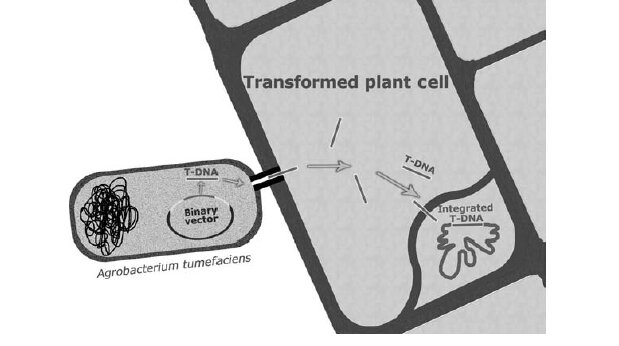

## Theory

#### What is Gene cloning?
Gene cloning can be defined as isolating and amplifying the gene of interest which is achieved by insertion of gene into a bacterium where it can be replicated. 
Thus, by using Cloning Technology we are constructing a novel DNA molecule by joining DNA sequences from different sources. The product formed through this technology is described as recombinant DNA.

#### The easiest way to explain is by understanding how it is done
-	Isolating the gene of interest (fragment of DNA)
-	This fragment of DNA is inserted into a DNA molecule called a vector.
-	The vector with incorporated gene of interest is called “recombinant vector or molecule”
-	This recombinant vector is introduced into a host cell. 
-	The recombinant vector multiplies in the host cell, producing numerous identical copies of the cloned genes.

#### Gene cloning experiment has 4 essential components- 
-	Enzymes for cutting & joining the DNA fragments into vector molecules. (to transfer the DNA fragments into the vectors)
-	Cloning vehicles or vectors.
-	DNA fragments i.e. gene libraries.
-	Selection of a clone of transformed cells that have acquired the recombinant chimeric DNA molecule. 

Before understanding the details of different aspects of gene cloning, examining the significance of gene cloning is important.

#### Let’s start by saying that have you heard the name “Bt Cotton”?
*As you might know that Bt Cotton is the genes from bacterium Bacillus thuringiensis which is cloned and inserted into crops like corn, cotton and soybeans to provide resistance to insect pests. These Bt crops produce a protein that is toxic to certain insects, reducing the need for chemical pesticides.*

This example clearly explains how gene cloning in plants has led to significant advancement in this field. Just by utilizing characteristics of some gene, the characteristics of another gene can be modified.    
Thus, Gene cloning serves a different purpose when introduced and multiplied into the host cell. Cloning the genes help in understanding the function of specific genes in plant development, physiology, response to environmental stress etc. It involves enhancing the desired traits, introducing new traits, understanding gene expression and regulatory patterns, preserving & protecting genes from endangered plant species etc. 

#### Gene Isolation 

1.	Genome Mapping / Chromosome mapping 
A genome's route map is established through the mapping of chromosomes, which aids in the location and manipulation of key genes. It facilitates the determination of the molecular environment for DNA sequences that code and those that do not.
The map of a chromosome can be of 2 types – 
-	Genetic map
-	Physical map

#### Genetic Map
A genetic map shows how genes are arranged in a straight line on a chromosome. It is made from information about meiotic recombination. The order of the chromosomes is shown by these maps, which are mostly theoretical. The distance between them is shown as a fraction of recombination. They do not specify where the gene is physically located or how far apart they are in base pairs.

#### Physical Map
They tell about the physical position of genes on a chromosome. 
Distances are measured in “base pairs”. Since, genetic maps and physical maps are available globally, this information can be used for crop improvement & isolation purposes. 

2.	Isolation of Gene coding for specific proteins
When a gene has to be isolated on the basis of the function, two main processes are generally used –

#### Protein Purification – 
First, the protein linked to the relevant gene is purified. This entails separating the protein from cells or tissues and purifying the protein sample using methods like electrophoresis and chromatography.

#### Complementation of Mutant Phenotype-
Next, the relevant gene is found using the purified protein, this involves introducing the gene (or its protein product) into a mutant organism or cell that lacks the functional gene and displays a certain mutant phenotype .The identification of the gene responsible for the observed function is confirmed if the insertion of the gene or protein restores the normal phenotype (complements the mutation).
Before mentioning the process, one thing that should be kept in mind is that cDNA or complementary DNA can be used to isolate the corresponding gene from the genomic DNA. 

#### How is cDNA synthesised?

*It is to be noted that cDNA is synthesised from mRNA or messenger RNA by
an enzyme called “reverse transcriptase”. So, by isolating specific mRNA, one
can synthesize cDNA which can further help in gene isolation. For this
purpose, antibodies are produced against specific proteins for which gene is
to be isolated.*

##### Steps for isolation of a gene for a specific protein-
1.	Purification of protein products of a gene.
2.	Raising antibodies against specific protein.
3.	Use antibodies for precipitation of polysomes.
4.	Isolation of mRNA from polysome fraction.
5.	Synthesizing cDNA with the help of reverse transcriptase.
6.	Cloning of cDNA.
7.	Confirm identity of cDNA using translation product.
8.	Use specific cDNA probe for screening a complete or partial genomic library (Colony hybridization).
9.	Select genomic clone and isolate the gene.

3.	Isolation of gene that are tissue specific in function 
It is considerably simpler to separate genes that are expressed in particular tissues. Genes encoding storage proteins, for instance, are expressed only in growing seeds. These genes can be isolated because the mRNA that is recovered from these particular tissues either richly contains this particular mRNA or exclusively belongs to the gene of interest.   
In order to isolate particular genes, it is possible to make use of specialized molecular probes, such as DNA or RNA, if they are accessible. There is a possibility that these probes are derived from another species that possesses the same gene, or that they are manufactured artificially by using a portion of the amino acid sequence of the protein.    
(A probe is a molecule (a segment of DNA or RNA) that recognizes the corresponding sequence in DNA or RNA molecules through the process of molecular hybridization. This recognition enables the identification and separation of specific DNA sequences from an organism. )
The probes obtained from one species and used for another species are called heterologous probes. These are very effective in identifying gene clones during colony hybridization/ plaque hybridization/ Southern blots.

##### Steps for isolation of a gene for a tissue specific function-
1.	Gene with tissue specific function.
2.	Isolation of specific mRNA.
3.	Synthesize cDNA by reverse transcriptase.
4.	Clone cDNA.
5.	Isolate specific cDNA clone.
6.	Colony hybridization.
7.	Select genomic clone and isolate the gene.

### Cloning method based on DNA insertion

#### Transposons
Transposons are mobile genetic elements. They are segments of DNA that are not autonomous and have the potential to insert themselves at random into the genome, plasmids, or bacterial chromosomes without the requirement of the recombination system of the host cell. Furthermore, they have the capacity to integrate at various locations within the genome and to migrate across the genome, which is referred to as transposing. 
The phenotypic of an organism might undergo discernible changes as a consequence of this process, which can have a substantial impact on the activity of genes.  

In the process of inserting themselves into a gene, transposons have the potential to interfere with the normal function of that gene. This is due to the fact that the transposon sequence has the potential to disrupt the coding sequence or regulatory areas of the gene, thus preventing the gene from being produced in the appropriate manner.  
It is common for a mutant phenotype to result from the interruption of gene function that is caused by transposon insertion. When compared to its typical state, this indicates that the organism may display new or altered physical characteristics.  
Many transposon-induced mutations are unstable. Transposons' capacity to remove themselves from the DNA causes instability. After excising itself from a gene, a transposon can reverse the mutation and restore gene function.  
Transposon excision causes phenotypic reversion in a varied fashion. Some cells in the same organism may show the mutant phenotype (where the transposon is still inserted), while others may revert to the normal phenotype (where the transposon is excised and gene function is restored).  
This variation is a sign of transposon activity and can be used to track their migration in the genome.

#### Illustration - CORN KERNELS 
Pigment genes determine maize kernel color. Say a gene creates a purple color in kernels.
A transposon disrupts the pigment-producing gene. This disturbance can impede pigment production, resulting in colorless (yellow or white) kernels. Colorless kernels come from transposon insertion.  

Sometimes a transposon can remove itself from a gene, restoring its function. If this excision occurs during kernel formation, the gene produces pigment again. Parts of the kernel that were colourless develop purple again, creating a speckled or variegated pattern.  

The kernels have purple and colourless specks. Different transposon excision time and frequency can cause variegation.  

Transposons serve as valuable instruments for generating and detecting mutants, enabling researchers to isolate and investigate associated genes.  

*Insertional mutagenesis* is a method in which transposons are randomly inserted into the genome to interrupt gene function, resulting in the creation of mutant phenotypes that help uncover the roles of the disrupted genes.  
Transposons integrate into different genes, resulting in disruptions. The disturbance can result in detectable mutant phenotypes, aiding researchers in identifying genes associated with particular traits or tasks.

Transposons function as markers that indicate the position of the gene that has been disrupted.  

*Identifying and isolating the tagged genes is facilitated by the knowledge of the transposon sequence, which can serve as a marker. After being found, these genes that have been tagged can be replicated for additional examination.*

Figure 1. The major steps in isolation of gene by transposon tagging

#### Types of cloning methods

1.	**Subtractive cloning**  
In order to find and isolate genes that are different or absent in two plant samples, subtractive cloning is a useful technique. The objective of gene cloning is to find and clone the genes that are missing in a mutant plant compared to a wild-type plant.  

Cut wild type DNA into small pieces using a restriction enzyme. Shear mutant DNA randomly and label it with Biotin. Heat both these DNA pieces so that they can hybridise and make a single strand. Most of the wild-type DNA will find a complementary strand in the mutant DNA and form double-stranded hybrids.  

Pour the mixture through a bead column coated with avidin. Mutant DNA labelled with biotin, together with any hybrid DNA attached to it, will adhere to the beads.  
When the deleted region of the mutant DNA is not matched by the wild-type DNA, the beads will not cling to the beads, allowing the DNA to pass through the column.  
Collect the DNA that passes through the column (this is enriched for DNA fragments missing in the mutant). Repeat the hybridization and capture steps several times to ensure that you enrich for the specific DNA fragments corresponding to the deleted region.  
Further, use PCR to amplify the enriched DNA fragments & clone the amplified gene into a vector for further analysis.

2.	**Map Based cloning**   
Genes can be found and isolated using a method called map-based or positional cloning, which is based on chromosomal locations. Finding DNA markers that are strongly associated with the target gene is the foundation of this strategy, which involves using these markers to "walk" towards the gene through overlapping DNA clones.   
Finding a DNA marker associated with the target gene and using it to find overlapping DNA segments that eventually lead to the gene itself is the fundamental principle of map-based cloning.  
It is necessary to map the genes that are responsible for the changes in traits to chromosomal sites that are close to known DNA segments, sometimes known as markers.  
It is possible that these markers are microsatellite markers or RFLP markers, which stands for restriction fragment length polymorphism.

### Vectors

### A.	Cloning vectors for higher plants 

Illustration - Just like mosquito acts as an insect vector to transfer the malaria parasite into human body, similarly plasmids acts as vector to transfer the gene of interest into the host organism.

Three types of vector system have been used with varying degrees of success with higher plants- 
   a. Vector based on naturally occurring plasmids of Agrobacterium.
   b. Direct gene transfer using various types of plasmid DNA.
   c. Vectors based on plant viruses. 

  a. Vector based on naturally occurring plasmids of Agrobacterium.
The Ti(tumour - inducing) plasmid that is present in the cell wall of this bacteria carries numerous genes involved in the infectious process. These genes direct the synthesis of unusual compounds, called opines, that the bacteria use as nutrients. Using the Ti plasmid to introduce new genes into a plant cell.
There are **novel strategies** that are used for inserting new DNA into plasmid these are- 

1.	**Binary vector strategy**   
In this, the tumour causing genes have been removed from Agrobacterium to prevent formation of tumour in plants but virulence genes are retained that help in transfer of T DNA from Agrobacterium to the plants.  
Binary vector is a smaller plasmid that contains T-DNA region, which will be transferred to the plant later. The gene of interest is cloned into the T-DNA region of this binary vector. Now, this constructed binary vector is transferred to Agrobacterium cells.   
The Agrobacterium genes already contain the disarmed Ti plasmid with virulence genes. Further, this Agrobacterium that has a binary vector is co-cultivated with plant cells or tissues. During this process, the virulence genes on the disarmed Ti plasmid are activated, leading to the transfer of the T-DNA region from the binary vector into the plant cell genome.  
The T-DNA region, including the gene of interest, integrates into the plant genome. This integration is stable and allows the gene to be expressed in the plant cells.  

Figure 2. The binary vector strategy

2.	**The co-integration strategy**     
This makes use of a single large Ti plasmid in Agrobacterium where the gene of interest is integrated into the T-DNA region through homologous recombination with an intermediate vector.
The gene of interest is cloned to an intermediate vector. The intermediate vector is introduced into the Agrobacterium that combines with disarmed Ti plasmid to form co-integrated plasmid. Thus, a single plasmid is formed after co-integration by homologous recombination which is transferred to the plant cells.

#### What’s New  
There are cloning vectors that are based on the Ri Plasmid of Agrobacterium rhizogenes. The transfer of T-DNA from an Ri plasmid to a plant results not in crown gall but hairy root disease, which is massive proliferation of highly branched root systems. 

### B.	**Cloning genes in plants by direct gene transfer**   

When a supercoiled plasmid DNA (simple bacterial plasmid) in which an appropriate selectable marker (e.g. a kanamycin resistance gene ) and gene of interest has been inserted, is then introduced into plant embryo, the cloning by such method is “direct transfer method”.

Figure 3. Direct gene transfer

### C.	**Plant viruses as cloning vector**   

Plants are susceptible to viral infection so, even if it would be convenient to use viruses as vectors, it is not preferred as plant viruses majorly have a genome of RNA and manipulation with RNA is a difficult task. 
“Caulimoviruses” and “Geminiviruses” are known to infect higher plants but are not suited to gene cloning. 

### Cutting & Joining DNA molecules 
	
1.	**Enzymes for cutting - Restriction endonucleases**   
Identification of incoming foreign DNA into the cell & breaking up into fragments is called restriction. In order to prevent host DNA from being cleaved, modification involves methylating certain bases to safeguard the cell's own DNA.   
The circular vector must be cut at a single location so that the DNA fragment to be cloned can be added during the creation of a recombinant DNA molecule. Each vector must only be cut once, and every vector molecule must be cut at exactly the same location. Enzymes called restriction endonucleases cut DNA at certain sites. 

2.	**Joining** 
The enzymes used to join DNA fragments are called DNA ligases. When the vector and the DNA are cut by the same restriction enzyme, the overlapping ends of these cut pieces will then be complementary to each other. 
These cut pieces when joined will form complementary base pairs between overlapping terminal single-stranded DNA sequences.

3.	**Ligation**  
Ligases act on DNA substrates with 5′ terminal phosphate groups and form the phosphodiester bond between the two DNA sequences (vector molecule and the DNA to be cloned) to join them together. This is the final step in construction of a recombinant DNA molecule. This process is called ligation.

